<h1 align="center">👋 Hi, I'm Heritiana Hasina Rasamoelina</h1>

  

  
  
  
  
  

---

### 🧠 About Me

I'm a **full-stack developer** passionate about building **modern, scalable, and user-friendly applications** with **JavaScript**, **TypeScript**, and **React**.

- 🏫 Student at **42 Antananarivo**, part of the **42 Network** — a peer-to-peer, project-based curriculum with **no teachers, no lectures**, just real problem-solving and autonomy.
- 🎯 Hands-on experience delivering **2 major full-stack projects**, from database design to production-ready UI.
- 🔍 Currently deepening **C / C++** and low-level programming through the 42 cursus, alongside my web development work.
- 🤝 Open to **freelance projects** and **team collaborations**.

---

### 🚀 Featured Projects

#### 🎓 [MyScholaria](https://github.com/hrasamoe/myscholaria) — *School Management System*
`TypeScript` `React` `MUI` `Node.js`

- ✅ Fully **responsive** across all devices
- 🌐 **Multi-portal architecture**: Admin, Staff, Teacher, Student, Parent
- ⚡ Roadmap: evolving into a **PWA**, then **React Native**
- 📂 **Open-source** — feedback and contributions welcome!

#### 🔒 Private Full-Stack Project
`Modern Stack` `Confidential`

- 🏗️ Built with a modern, production-grade architecture
- 🔒 Details to be shared soon

---

### 🛠️ Tech Stack

**Languages & Frontend**

**Backend & Tools**

**Databases & Cloud**

---

### 📊 GitHub Stats

  
  

  

---

### 🐍 Contribution Snake

  <picture>
    <source media="(prefers-color-scheme: dark)" srcset="https://raw.githubusercontent.com/hrasamoe/hrasamoe/output/github-contribution-grid-snake-dark.svg" />
    
  </picture>

---

### 💼 Open to Opportunities

I'm available for **freelance missions**, **internships**, and **collaborative projects** in web development. If you're a recruiter or have an idea in mind — let's talk!

🌐 **[Portfolio](https://portfolio-22565.web.app/)**
📧 **[hrasamoevj@gmail.com](mailto:hrasamoevj@gmail.com)**
📘 **[Facebook](https://www.facebook.com/hrasamoe)**
✈️ **[Telegram](https://t.me/hrasamoe)**

---

<i>✨ Let's build something amazing together! 🚀</i>
